# Manual de Usuario de AutoManager 🚗💼

Bienvenido al Manual de Usuario de AutoManager, una aplicación para gestionar personas, coches y sus asignaciones. En este manual, aprenderás cómo utilizar todas las funciones de la aplicación y entenderás las validaciones que se aplican en cada caso.

## Funciones Principales

### Creación de Personas
👤 Desde la pantalla principal, haz clic en el botón "Añadir" de la lista de personas.

👉 Completa el formulario con el nombre y apellido de la persona.

💾 Haz clic en "Guardar" para crear la persona.

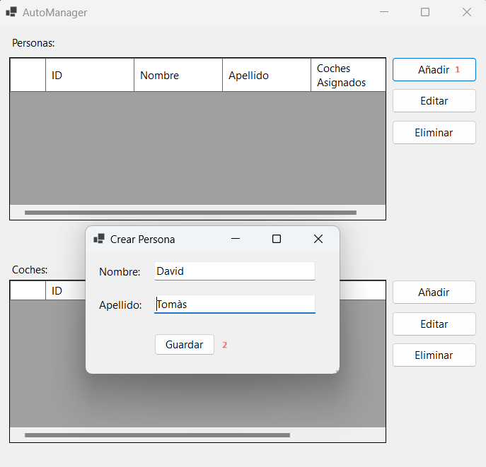

### Creación de Coches
🚘 Desde la pantalla principal, haz clic en el botón "Añadir" de la lista de coches.

📝 Completa el formulario con la marca, modelo y VIN del coche.

💾 Haz clic en "Guardar" para crear el coche. 

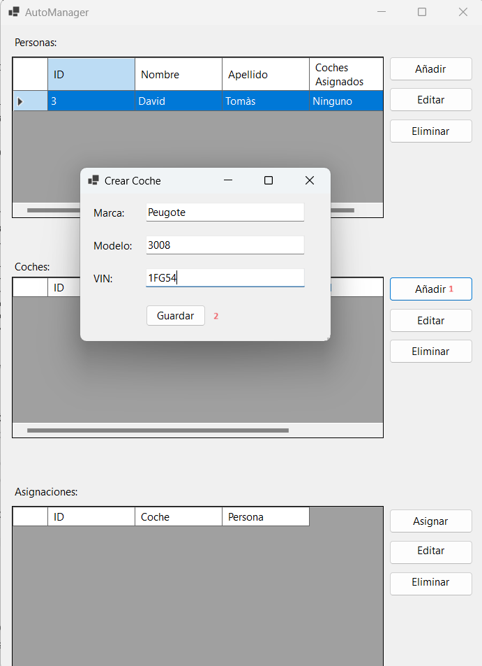

### Asignación de Coches a Personas
✏️ Desde la pantalla principal, selecciona el boton "Asignaciones".

👤 Selecciona una persona de la lista desplegable.

🚗 Selecciona un coche de la lista desplegable.

✔️ Haz clic en "Asignar" para asignar el coche a la persona.

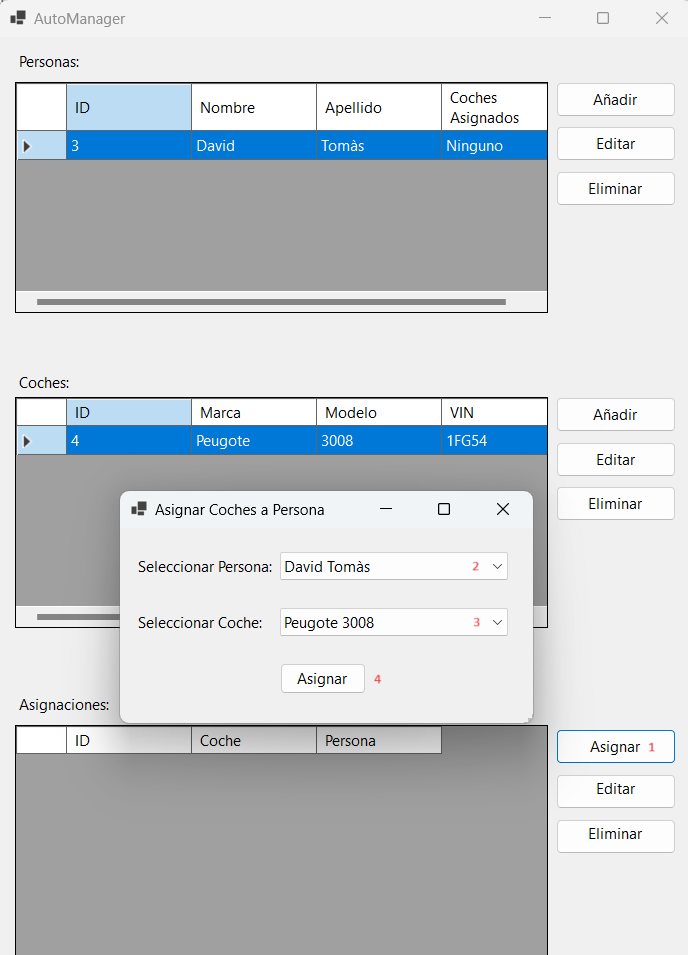

### Edición de Personas y Coches
✏️ Desde la pantalla principal, selecciona el elemento que deseas editar de la lista de Personas, Coches o Asignaciones.

🔄 Haz clic en el botón "Editar" .

📝 Realiza los cambios necesarios en el formulario.

💾 Haz clic en "Guardar" para aplicar los cambios.

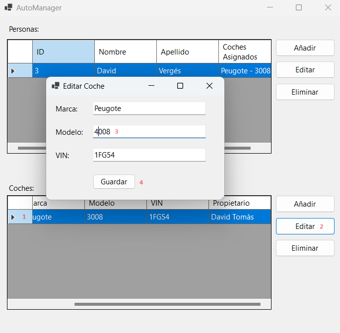

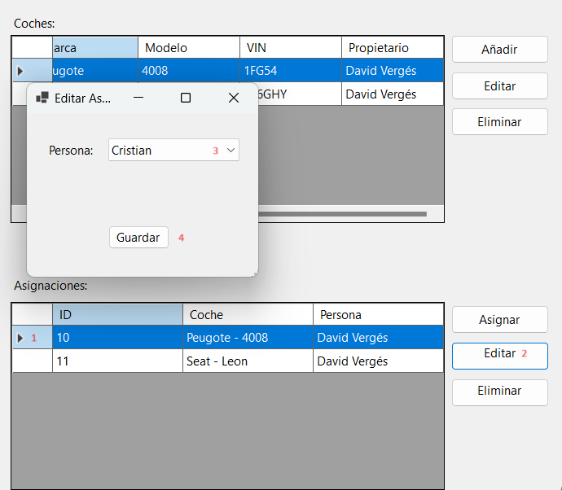

### Eliminación de Personas y Coches
❌ Desde la pantalla principal, selecciona el elemento que deseas eliminar de la lista de Personas o Coches.

🗑️ Haz clic en el botón "Eliminar" .

⚠️ Haz clic en "Eliminar Coche" "Eliminar Persona" para aplicar los cambios.

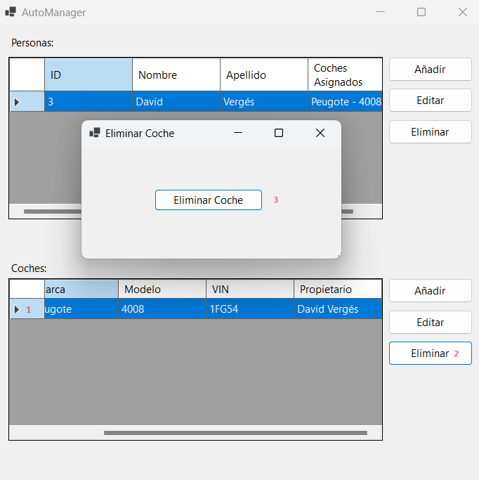

## Validaciones

### Personas
🔒 No puede existir más de una persona con el mismo nombre y apellido.

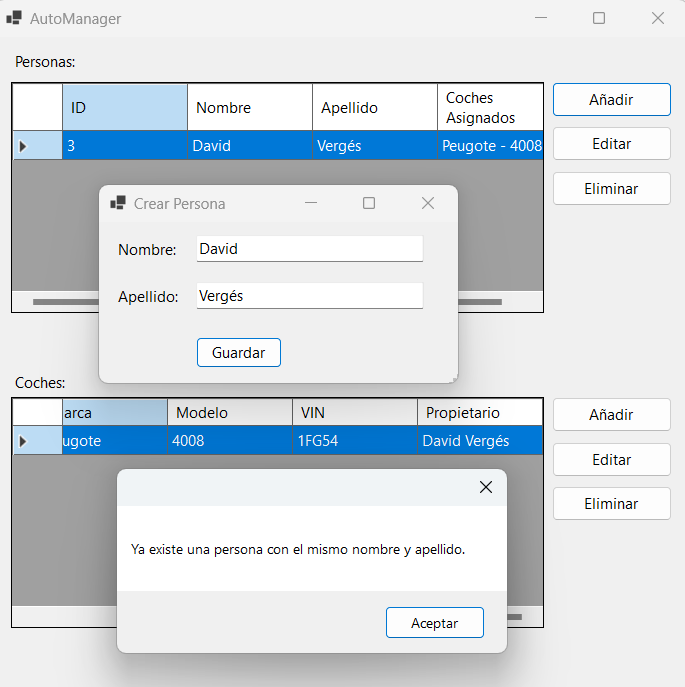

### Coches
🔒 No puede existir más de un coche con el mismo VIN.

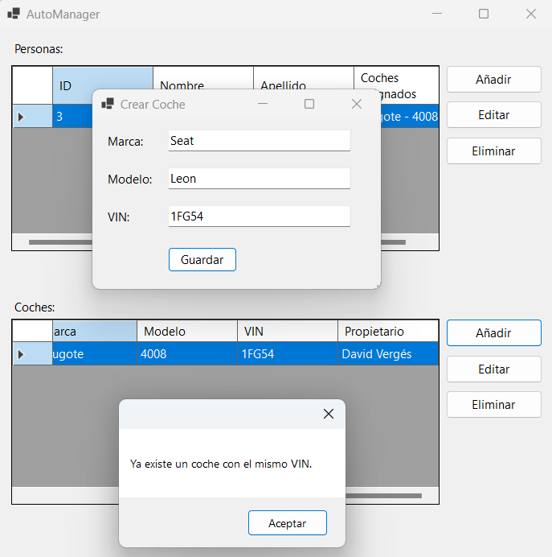

### Asignaciones
🔒 Una persona puede tener uno o más coches.

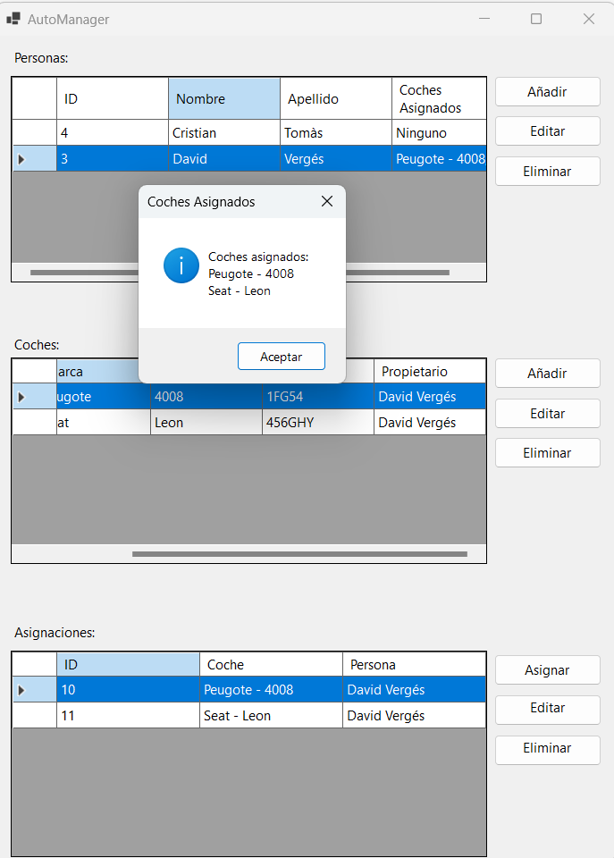

🔒 Un coche solo puede pertenecer a una persona (solo puede existir un propietario por coche).

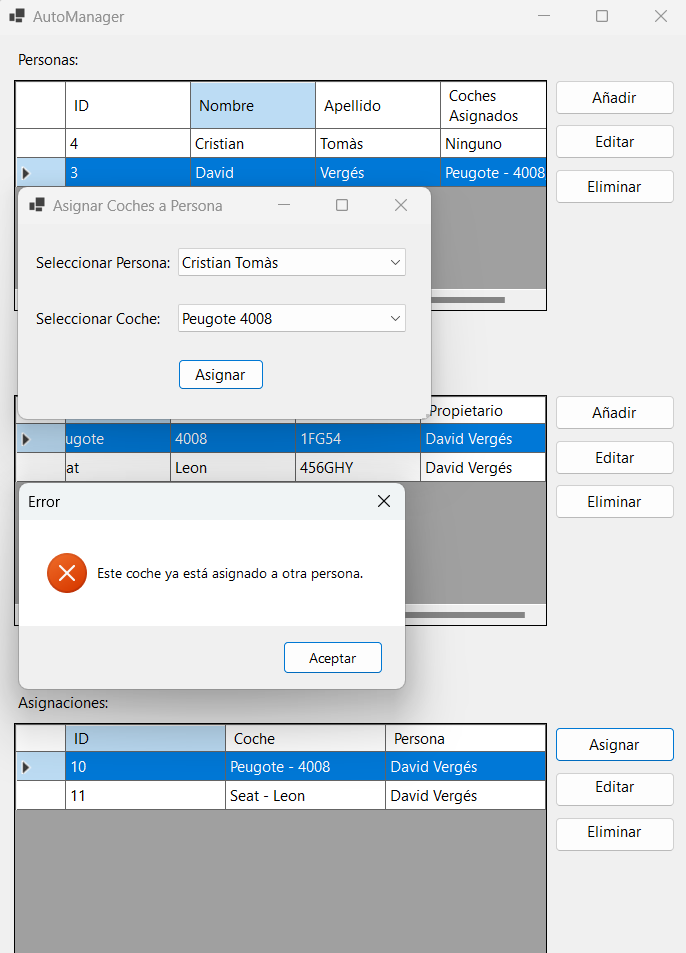

## AutoManagerDB

🔍 Comprovació de que tot el que emfet fins ara s'ha realitzat a la base de daes.

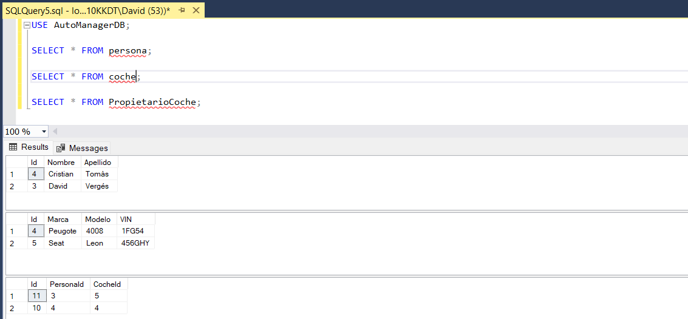

